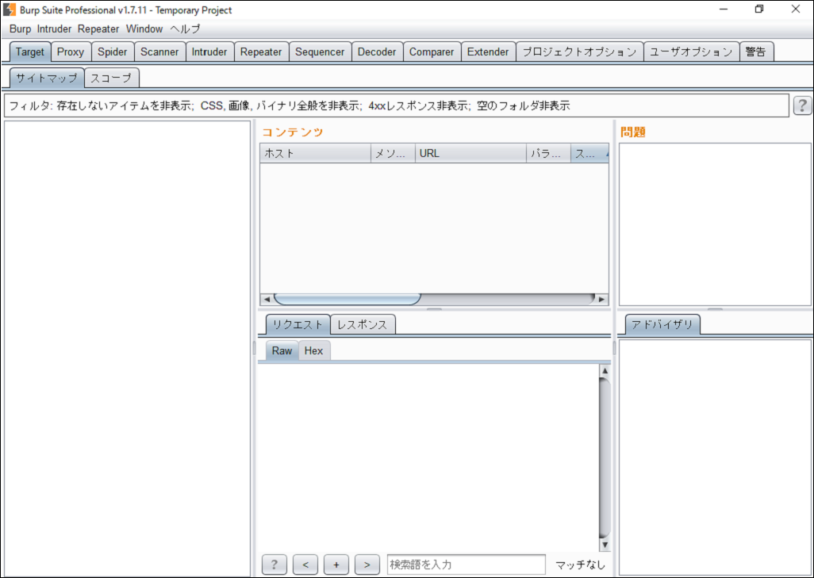
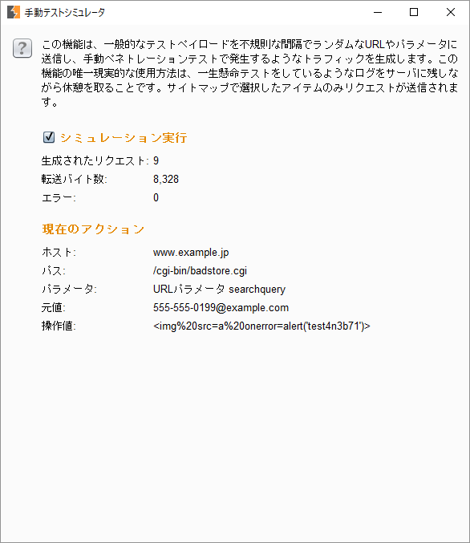

Belle (Burp Suite 非公式日本語化ツール)
====

このツールは、PortSwigger社の製品であるBurp Suiteのインタフェースを、日本語化するツールです。

  
  

## 使用方法

本ツールは、Javassistを使用しています。次のリンクから最新のライブラリファイル(javassist.jar)をダウンロードしておいてください。

[Releases · jboss-javassist/javassist](https://github.com/jboss-javassist/javassist/releases)

### インストーラーを使ってBurp Suiteをインストールした場合

[https://github.com/ankokuty/Belle/releases](https://github.com/ankokuty/Belle/releases)より最新の belle.jar 、及び上記 javassist.jar をダウンロードし、Burp Suiteがインストールされているフォルダにコピーします。
インストール時に変更していなければ、``C:\Program Files\BurpSuiteCommunity`` や``C:\Program Files\BurpSuitePro``にあると思います。

BurpSuiteFree.vmoptions か BurpSuitePro.vmoptions ファイルをエディタで開き、１行追記します。

```bash
# Enter one VM parameter per line
# For example, to adjust the maximum memory usage to 512 MB, uncomment the following line:
# -Xmx512m
# To include another file, uncomment the following line:
# -include-options [path to other .vmoption file]
-Xmx12151m
# 以下の行を追記
-javaagent:belle.jar
```

なお秀丸32bit版などではVirtualStoreにより、ファイルの編集がうまく反映されない場合があるようです。管理者権限でメモ帳を起動し、ファイルを編集してみてください。
編集後、通常通りスタートメニューのショートカット等から起動します。

### Burp Suiteのjarファイルを任意の場所にインストールした場合

[https://github.com/ankokuty/Belle/releases](https://github.com/ankokuty/Belle/releases)より最新のbelle.jar、及び上記javassist.jarをダウンロードし、Burpのjarファイル(`burpsuite_free_v1.7.06.jar`等)と同じフォルダにコピーします。

Burpのjarファイルがあるフォルダに移動し、(-jar オプションより前に) -javaagentコマンドラインオプションを指定して起動します。

```
java -javaagent:belle.jar -Xmx1024m -jar burpsuite_free_v1.7.06.jar
```

### アップデート方法

[https://github.com/ankokuty/Belle/releases](https://github.com/ankokuty/Belle/releases)より最新のbelle.jarをダウンロードし上書きコピーし、Burp Suiteを再起動してください。

### その他

以前のバージョンでは、カレントディレクトリの ja.txt を読み込んでいましたが現在は内部に取り込んでいるため、このファイルは不要です。

## 注意事項

このツールは、私個人が勝手に開発したもので、PortSwigger社は一切関係ありません。日本語訳の間違いはもちろんのこと、本ツールを使用したことによる不具合等についてPortSwiggerに問い合わせないようお願いします。

このツールは内部でJava実行環境のバイトコードを変更します。Oracle社のJava実行環境で使用した場合、[バイナリ・コードライセンス](http://www.oracle.com/technetwork/java/javase/terms/license/index.html)に違反する可能性があります。ライセンスを確認の上、[OpenJDK](http://openjdk.java.net/)等その他のJava実行環境での実行を推奨します。Professional版 2.0.15beta以降のインストーラーには、OpenJDKのJava実行環境(JRE)が内包されています。

このツールは単純に、辞書ファイルで指定した文字列にマッチする文字列を見つけると、対応する日本語訳に変換しています。
影響範囲をGUI表示部分に限定しているつもりですが、送受信したHTTPメッセージも意図せず変換してしまっている可能性があります。
Webアプリケーションテストへの影響を確認の上、自己責任で使用してください。

PortSwigger社から英語メッセージ一覧をもらったわけではなく、使用中に英語表記であることを目視した箇所を適宜翻訳しているため、おそらく網羅されていません。
未翻訳の箇所や間違いを見つけた場合は、ご連絡ください。

## References

- [Burp Suite](https://portswigger.net/burp/)
- [Burp Suite Japanユーザグループ](https://groups.google.com/d/forum/burp-suite-japan)
- [Burp Suite Japan](https://twitter.com/burpsuitejapan)

## Author

[@\_bun\_](https://twitter.com/_bun_)
